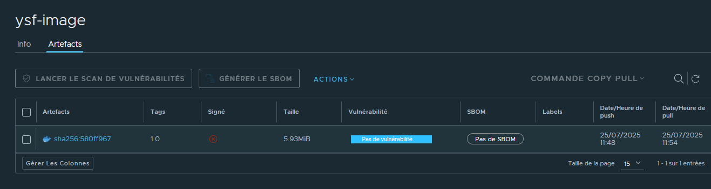
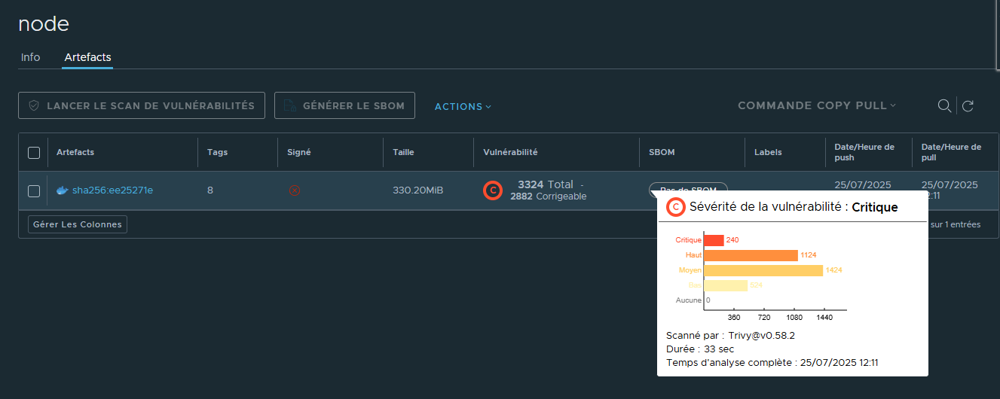

**Harbor Installation & Configuration - Errors and Solutions**
### Environment

* Host: Linux (student-node)
* Harbor Version: v2.12.2
* Docker Version: 20.10.21
* Docker Compose Version: 2.39.1
* Components: Trivy, Cosign (planned)

---

### Error 1: `Need to upgrade docker-compose package to 1.18.0+`

**Cause:** Outdated Docker Compose.
**Fix:**

```bash
sudo curl -L "https://github.com/docker/compose/releases/download/v2.39.1/docker-compose-$(uname -s)-$(uname -m)" -o /usr/local/bin/docker-compose
sudo chmod +x /usr/local/bin/docker-compose
```

---

### Error 2: `Cannot connect to the Docker daemon at unix:///var/run/docker.sock`

**Cause:** Docker daemon not running.
**Fix:**

```bash
sudo systemctl start docker
```

Ensure the current user has Docker privileges or use `sudo`.

---

### Error 3: `docker-credential-secretservice` issue

**Cause:** Missing/incompatible credential helper.
**Fix:**

```bash
sudo rm -f /usr/bin/docker-credential-secretservice
```

---

### Error 4: `docker-credential-none: executable file not found in $PATH`

**Cause:** Docker is trying to use a non-existent credential helper.
**Fix:** Create or edit the Docker config:

```bash
mkdir -p ~/.docker
cat > ~/.docker/config.json <<EOF
{
  "credsStore": ""
}
EOF
```
Or,
``` bash
cat > ~/.docker/config.json <<EOF
{}
EOF
```

---

### Error 5: `Error starting userland proxy: listen tcp4 0.0.0.0:80: bind: address already in use`

**Cause:** Port 80 is already in use.
**Fix:** Change Harbor's default port in `harbor.yml` to an available port, e.g.:

```yaml
hostname: mydomain.wafa.com
http:
  port: 84
```

Then re-run `./prepare` and `./install.sh`.

---

### Error 6: `failed to connect to tcp://postgresql:5432`

**Cause:** DNS resolution failure for PostgreSQL container.
**Fix:** Restart Harbor to allow proper container networking:

```bash
sudo docker-compose down
sudo docker-compose up -d
```

---

### Error 7: `docker login` failed - no such host

**Cause:** Custom domain (`mydomain.wafa.com`) not resolvable.
**Fix:** Add to `/etc/hosts`:

```bash
echo "127.0.0.1 mydomain.wafa.com" | sudo tee -a /etc/hosts
```

---

### Error 8: `docker push` fails with `invalid repository name`

**Cause:** Image not tagged under a valid Harbor project.
**Fix:**

1. Create a project in Harbor UI (e.g., `ysf`)
2. Tag image with project namespace:

```bash
docker tag alpine mydomain.wafa.com:84/ysf/ysf-image:1.0
docker push mydomain.wafa.com:84/ysf/ysf-image:1.0
```

---

### Testing Vulnerability Scanning with Trivy

#### ✅ Steps to Test

1. **Pull a known vulnerable image:**

```bash
docker pull node:8
```

2. **Tag the image with Harbor registry/project:**

```bash
docker tag node:8 mydomain.wafa.com:84/ysf/node:8
```

3. **Push the image:**

```bash
docker login mydomain.wafa.com:84
# Use admin / your password

docker push mydomain.wafa.com:84/ysf/node:8
```

4. **Enable Trivy scanning:**

* In Harbor UI: Go to `Projects > ysf > Configuration`
* Enable **Automatically scan images on push**

5. **View scan results:**

* Go to `Projects > ysf > node`
* Click on tag `8`
* Review vulnerabilities found by Trivy

---


### Optional: Enable Automatic Image Scanning

* Go to Project settings in Harbor UI
* Enable "Automatically scan images on push"

---

### Next Steps

* Set up **Cosign** for image signing.
* Configure HTTPS for Harbor to avoid warnings and ensure security.
---